# E-commerce Website


This project is the frontend part of a fullstack e-commerce website - PeacoPlaza. [Here to view its backend part](https://github.com/monodara/PeacoPlaza-Backend). The application allows users to search products, add items to wishlist and cart, review the cart. It also allows Admin roles to manage the products (creating new items, updating or deleting items.) The project is deployed at [https://monodara.github.io/PeacoPlaza-Frontend/].

## Features

| Role     | Use Case                                                  |
| -------- | --------------------------------------------------------- |
| Customer | Browser all products                                      |
|          | Filter products by category, search term, or price.       |
|          | Sort products by price                                    |
|          | Add product to / remove from wishlish / cart              |
|          | Browser a product's details                               |
|          | Make order                                                |
|          | choose a shipping address                                 |
|          | manipulate his own addresses                              |
|          | Review orders                                             |
|          | Register an account                                       |
|          | Log in/out                                                |
|          | Preview cart                                              |
|          | change the number of products in cart                     |
|          | Get inspiration from top-rated & most-purchased products. |
|          | Change user name                                          |
|          | Upload avatar                                             |
|          | Delete his own account                                    |
|          | Log in with Google account                                |
|          | Manipulate dark/light mode                                |
| Admin    | All functions for customers                               |
|          | Delete user accounts                                      |
|          | create, update, delete products                           |
|          | Update, delete orders                                     |

## Getting Started

As it's deployed, visit [this link](https://github.com/Integrify-Finland/fs17-Frontend-project) to run the project.

1. Register an account by inputting user name, email and password.
2. To use admin functionalities, please use this account
   ```
   email: demo.admin@mail.com
   password: SuperAdmin1234
   ```
   as the system doesn't allow to create another admin account.

### User Docker image

The image is published to Docker Hub. In case you have Docker installed, run `docker pull monodara/peacoplaza-fe:latest`, then run `docker run -d -p 3000:3000 monodara/peacoplaza-fe:latest`, you can use the application at [http://localhost:3000/](http://localhost:3000/)

In case you would like to run it locally, please follow:

1. Clone the repository using `git clone`;
2. Open the terminal and navigate to project folder.
3. Install packages and libraries by running `npm install` or `yarn install`.
4. Replace the apiKey in `index.tsx` with your key.
5. Run the project using `npm start` or `yarn start`. The application will automatically open a browser window at the address [http://localhost:3000/](http://localhost:3000/)

## Usage

#### Scripts

`"start": "react-scripts start"`, runs the development server.

`"build": "react-scripts build"`,bundles the app into static files for production.

`"test": "react-scripts test --transformIgnorePatterns 'node_modules/(?!@codemirror)/' --coverage"`, launches the test runner in interactive watch mode. Additionally, it ensures that test coverage is calculated,

`"eject": "react-scripts eject"`, moves the create-react-app configuration and scripts into the project, providing full control over them.

`"test-coverage": "jest --coverage"`, executes Jest tests and generates coverage reports.

#### Features

1.  Fetch products data from the API and display the items.
    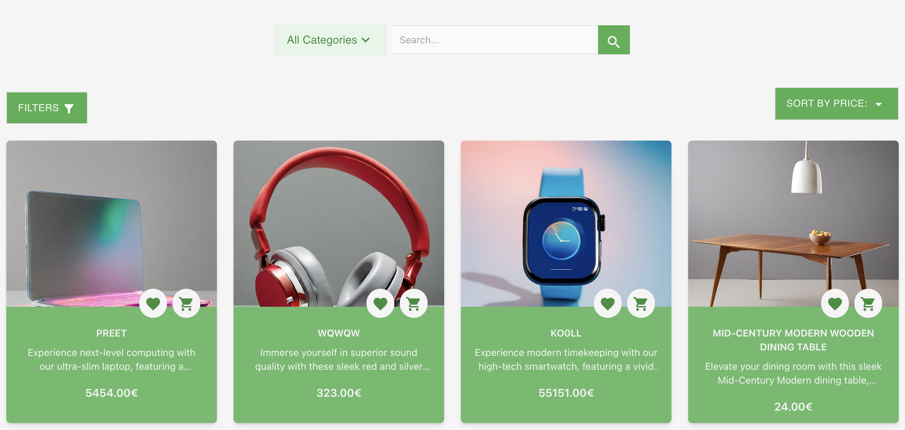
2.  Filter products by category and price.
    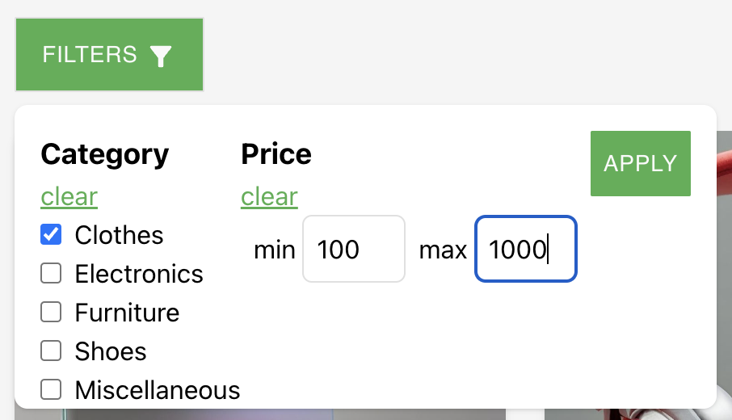
3.  Sort data by price in ascending/descending order.
    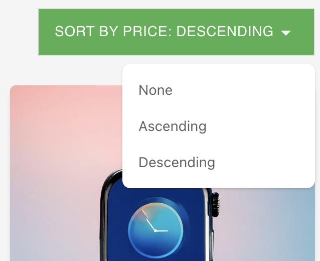
4.  Search for items by keyword and/or a specific category.
    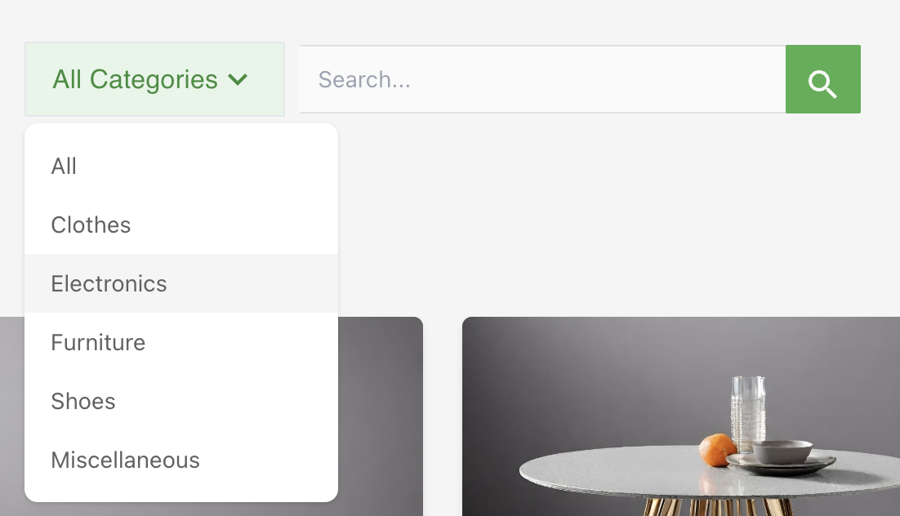
5.  Browser detailed information of a product.
    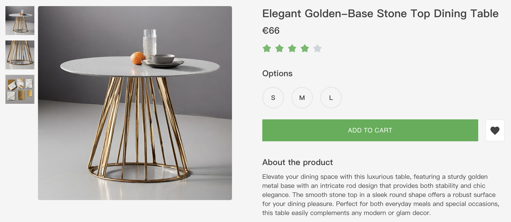
6.  Add products to wishlist from either the product list or the product details page by clicking the heart button. Remove a product from wishlist by clicking the trash button at the left-top corner.  
    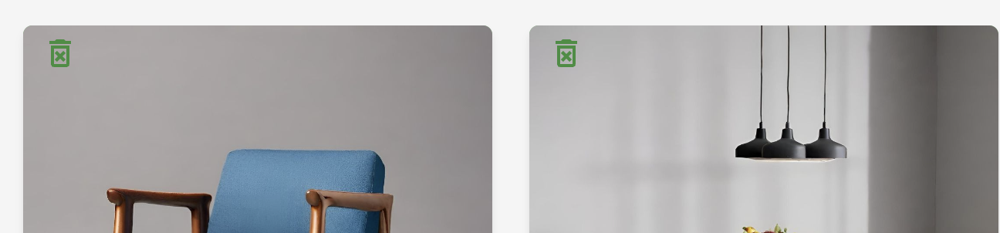
7.  Add items to cart from the entire list, wishlist or product details page. The number of items in wishlist and cart will be displayed on the Badges of icons.
    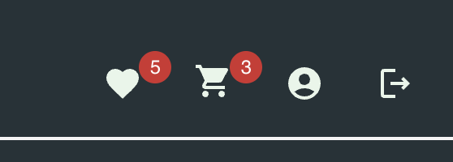
8.  Preview cart by a drawer popped over from right in which editing the products and their numbers are allowed.
    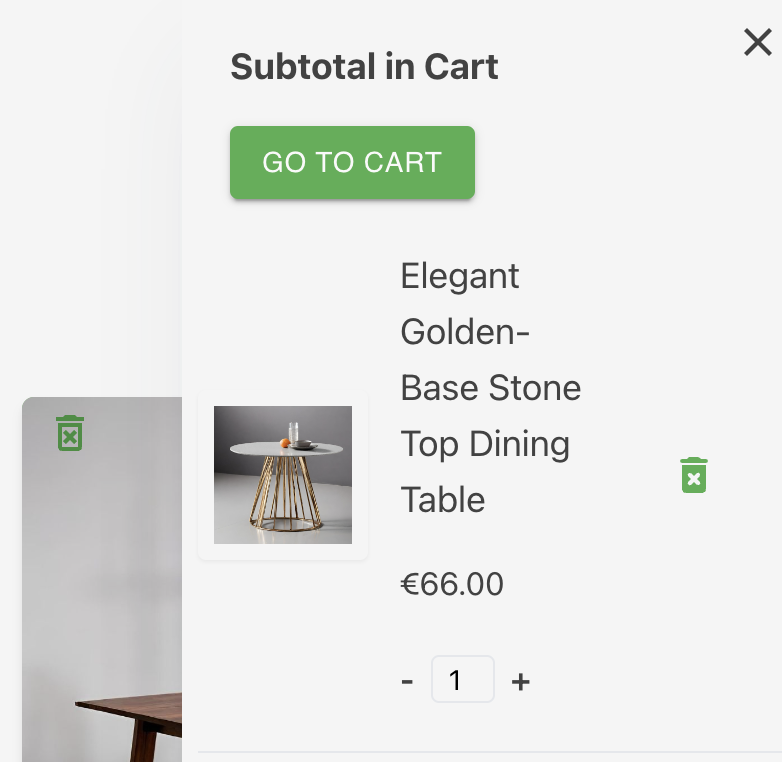
9.  In cart page, it's also welcomed to change the product's number. If the delete button is clicked or the number of product is reduced to 0, a Modal will pop out requesting for confirmation.
    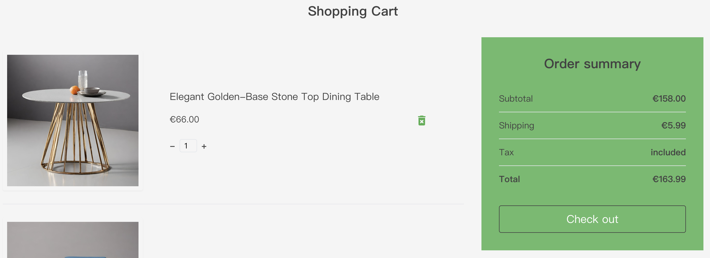
    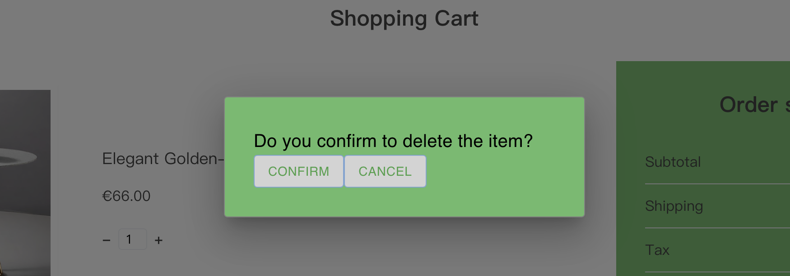
10. Checkout button will lead to login (if not yet), the user can login by email, by Google account, or register a new account.
11. Both login and register form have to be validated, which is implemented by `Formik` and `Yup`. Besides,the email and the avatar must pass the API endpoints.
    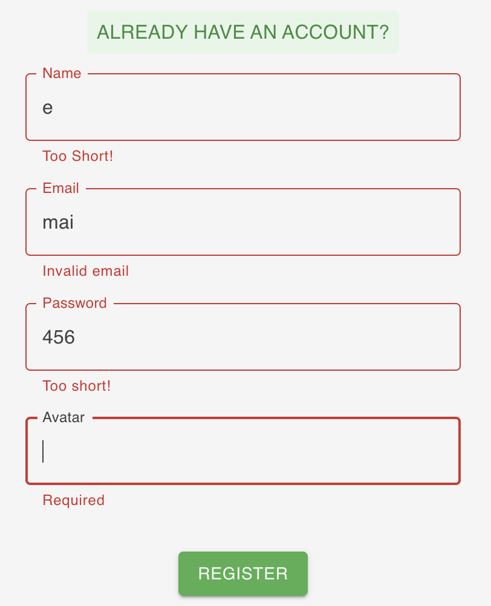
    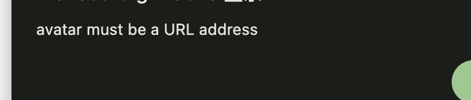
12. When a "Admin" role logs in, it's allowed to created/update/delete items.
13. Click the button to toggle light/dark mode, which is achieved by `React's Context` and `Material UI`'s Customered theme.
    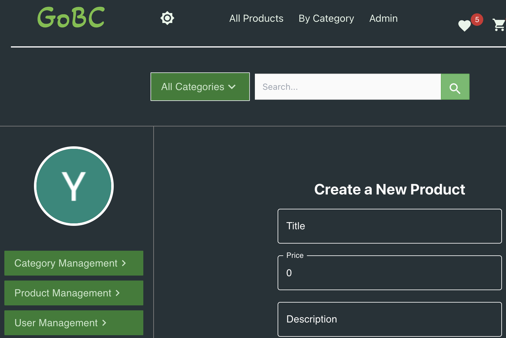
14. Responsive layout is build with `Tailwindcss`.
15. `React-scroll-to-top` is used to enable uses to reach the page top view smoothly.

## Architecture & Design

#### Pages & Components

```
src/
|-- app/
|   |-- store
|   |-- BaseSlice
|   |-- ...
|-  commonTypes
|-- components
|   |   |-- buttons
|   |   |-- footer
|   |   |-- search form
|-- features
|   |   |-- address
|   |   |-- avatar
|   |   |-- cart
|   |   |-- category
|   |   |-- order
|   |   |-- product
|   |   |-- theme
|   |   |-- user
|   |   |-- ProductCreation
|   |   |-- ProductUpdateOrDelete
|   |   |-- cart
|   |-- hooks
|   |-- assets
```

I broke components into small pieces. For example, the diagram below illustrates the how Products page is structured.
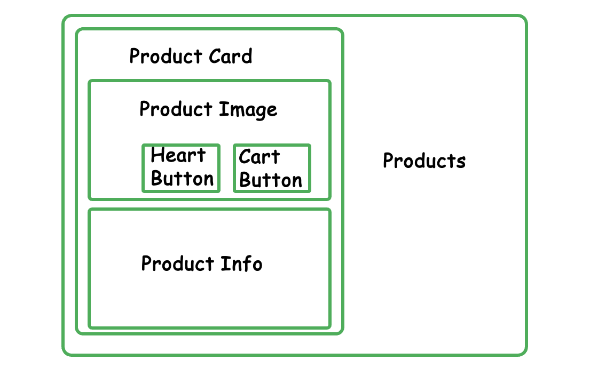
To enable the components to access states, I use `Redux` store to pool them. For example, by clicking the cart button from products page, wishlist page, a single product details page, and the trash button in cart drawer, `itemsInCart` state can be updated. Then, other components like the badge of cart button can select the state from the store.

In addition, I use Customered hooks to fetch data of a single product and to handle repeated dispatching actions specifically `ddToCart(item)` and `addToWishList(item)`.
Commonly used types, style and functions are exported from misc folder.

## Testing

#### Libraries

[Jest](https://jestjs.io/) is used for unit testing and [mswjs](https://mswjs.io/) for server mocking. By simply run `yarn test`, you can observe the test results dynamically.

For this project, I have implemented unit testing for the reducers.
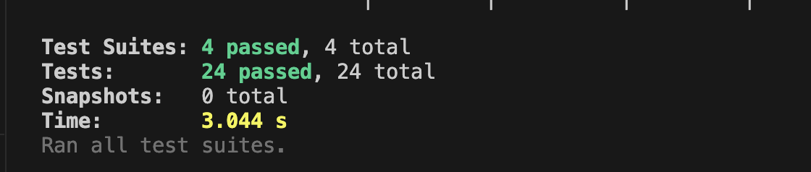
